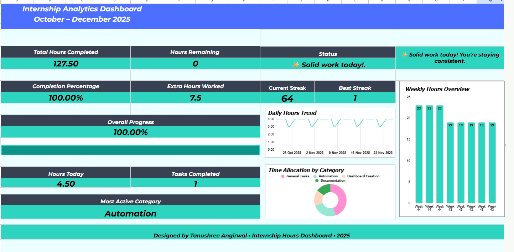

# 📊 Internship Hours Analytics Dashboard (Google Sheets)

A modern, automated dashboard built entirely in **Google Sheets** to track internship working hours, daily productivity, weekly performance, task categories, and overall progress.  
Designed with a clean teal aesthetic and built with no code.

---

## ⭐ Overview  
This dashboard transforms a simple hour-tracking requirement into a structured and interactive analytics system.  
It includes KPI cards, charts, streak tracking, and smart daily insights — all auto-updated using formulas, pivot tables, and clean UI design.

---

## 📌 Features

### **Automated KPI Summary**
- Total hours completed  
- Hours remaining  
- Extra hours  
- Completion percentage  

### **Visual Analytics**
- Daily Hours Trend (Line Chart)  
- Weekly Hours Overview (Bar Chart)  
- Task Category Distribution (Donut Chart)  
- Dynamic Progress Bar (SPARKLINE)  

### **Today’s Snapshot**
- Hours worked today  
- Tasks completed  
- Most active category  

### **Streak Tracker**
- Current streak  
- Best streak  

### **Other Features**
- Simple daily status message  
- Minimal teal-themed layout  
- Clean spacing and typography  

---

## 🧰 Tools Used
- Google Sheets  
- Pivot Tables  
- QUERY formulas  
- SPARKLINE  
- Basic automation (no Apps Script)

---

## 📝 Purpose  
I built this dashboard to track and present my internship hours in a more organized, automated, and visually appealing way.  
It also serves as a portfolio project demonstrating:

- Dashboard design  
- Data visualization  
- Analytical skills  
- Documentation and presentation  

---

## 📸 Dashboard Preview

---

## 📂 Files Included
- **internship-dashboard.xlsx** — Exported dashboard  
- **dashboard.png** — Preview image  
- **README.md** — Documentation  

---

## 📬 Contact  
If you'd like a customizable version of this template or want to connect, feel free to reach out!
